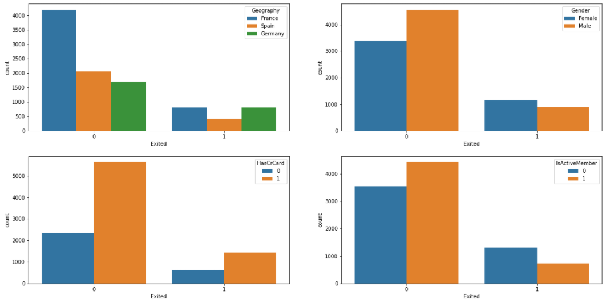

# Banking Customer Churn Prediction and Analysis
- Developed algorithms to predict customer churn probability based on labeled data via Python programming
- Preprocessed data set by data cleaning, categorical feature transformation, and standardization
- Trained supervised machine learning models including Logistic Regression, Random Forest, and K-Nearest Neighbors, and applied regularization with optimal parameters to overcome overfitting
- Evaluated model performance and analyzed feature importance to identify top factors that influenced the results

